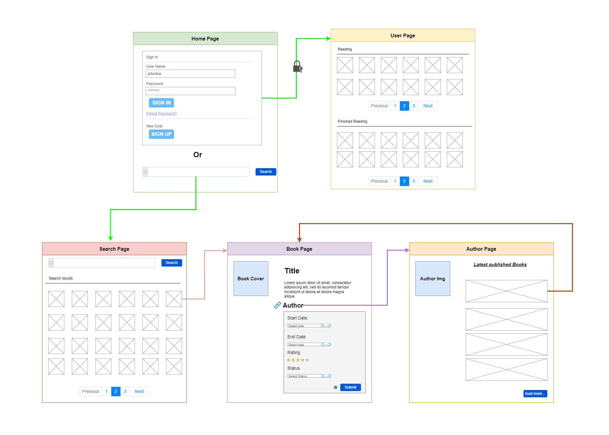
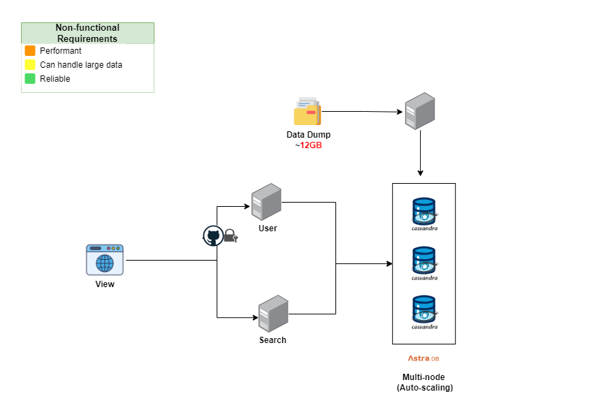
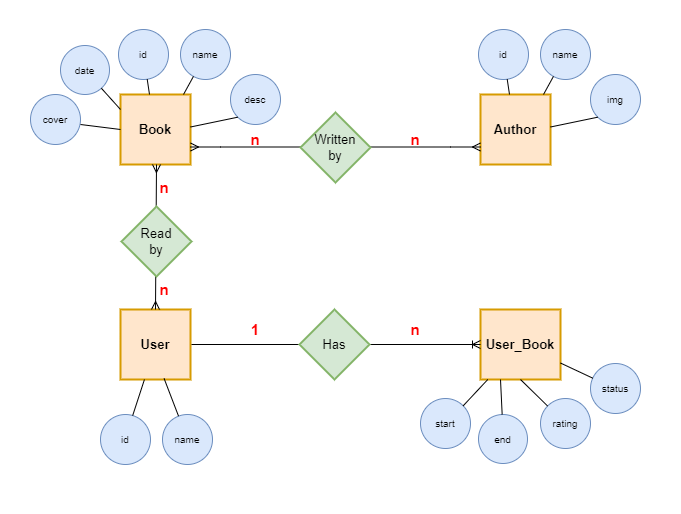
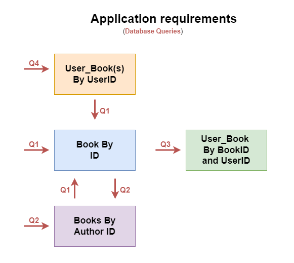
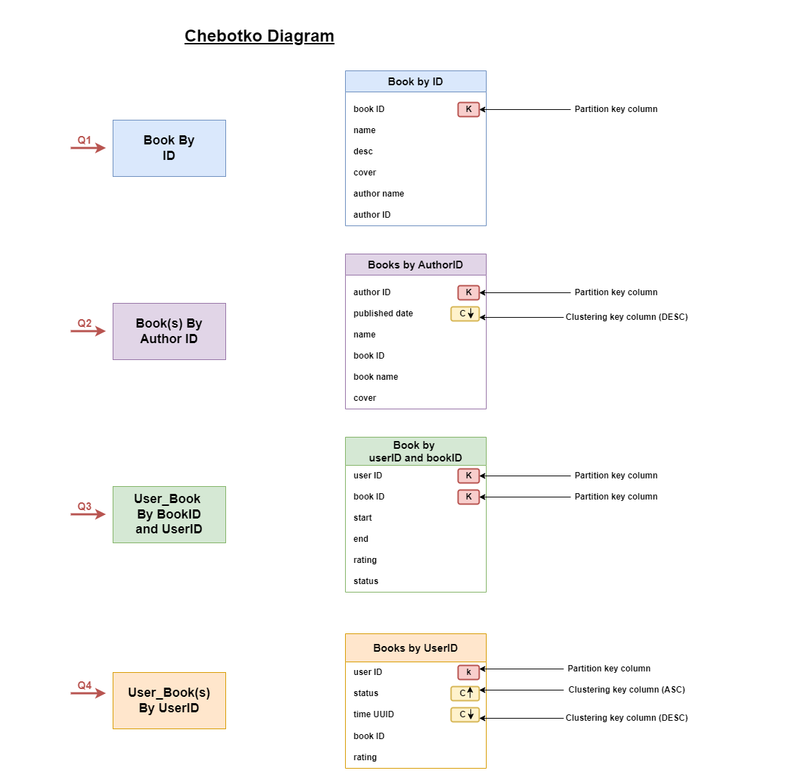

# 📰Better Reads: A Highly Scalable Book Tracking Application

**Better Reads** is a full-stack application inspired by GoodReads, built with a focus on scalability and high performance.  The primary objective is to create an application that can handle and serve a vast catalog of every book ever published in the world, allowing users to browse, track their reading progress, and rate books efficiently, even with ***28+ millions*** of book records.

## 💎Key Features

* **Comprehensive Book Catalog**: Store and serve information on every book ever published globally.
* **Book Tracking**: Users can mark books as read, currently reading, and rate them on a 5-star scale.
* **Reading Progress Tracking**: Users can track their reading progress and view their recently read books.
* **Highly Scalable Architecture**: Designed to handle large amounts of data and scale seamlessly with increasing user load.
* **High Performance**: Optimized for fast page loads and efficient data retrieval, ensuring a smooth user experience.

## 🛠️Tech Stack

* **Backend**: Spring Boot
* **Database**: Apache Cassandra (using DataStax Astra DB, a hosted Cassandra service)
* **Security**: Spring Security with GitHub OAuth login
* **View Rendering**: Thymeleaf
* **Data Access**: Spring Data Cassandra (repository pattern)

## Architecture Highlights

* **NoSQL Database (Apache Cassandra)**: Chosen for its ability to handle large amounts of data efficiently and scale horizontally.
* **Hosted Cassandra Service (DataStax Astra DB)**: Provides a managed Cassandra instance, eliminating the need for local installation and scaling based on load.
* **GitHub OAuth Integration**: Secure user authentication and authorization using GitHub OAuth.
  
## 😍User Experience (UX)

The application offers a user-friendly experience for browsing and tracking books. Here's a quick overview of the key functionalities:

<!--   -->

  

**Pages:**

* **Book:** View book details (cover, title, description). Logged-in users can mark books as "Read," "Currently Reading," or "Not Read." Optionally, a rating system can be implemented.
* **Author:** Lists all books written by a particular author in reverse chronological order (newest first). Accessible by clicking the author's name on the Book page.
* **Search:** Enables searching for books by title.
* **Login:** Uses OAuth (Github, Facebook) for user authentication (not required for basic search).
* **Home (Logged Out):** Provides search functionality.
* **Home (Logged In):** "My Books" section displays the user's recently read books (up to 50) in reverse chronological order, with the currently reading book at the top.

**User Flows:**

* Users can browse the app without logging in (search for books).
* Logged-in users can track their reading progress by marking books.
* Clicking on an author's name leads to the Author Page showcasing all their books.

## 🏗️System Design

The Better Reads application leverages a robust and scalable system architecture to efficiently handle book data and user interactions. Here's a technical overview:

<!--   -->

  

**Architecture**

The system follows a three-tier architecture:

1. **Presentation Tier:** Spring Boot web application with Spring MVC, Thymeleaf for templating. Handles user interactions, rendering views, and data communication.
2. **Application Tier:** Stateless Spring Boot application with Spring Security. Handles business logic and coordinates data flow.
3. **Data Tier:** Apache Cassandra database cluster (NoSQL) for scalable and reliable data storage.

**Key Decisions**

* **NoSQL Database (Cassandra):** Efficiently handles large data volumes, scales horizontally, and offers high availability.
* **Hosted Cassandra Service:** Leverages a managed service (DataStax Astra DB) for automatic scaling and reduced maintenance.
* **Spring Data Cassandra:** Provides seamless data interaction using a repository-based pattern.
* **GitHub OAuth Integration:** Secure user authentication and authorization via Spring Security.
* **Open Library API (Search Only):** Integrates for search functionality; other data operations use Cassandra.

**Data Modeling and Query-Driven Design**

The Cassandra data model is optimized for the application's most frequent queries, ensuring efficient data retrieval.

**Data Ingestion**

A separate Spring Boot service ingests book metadata from the Open Library data dump into the Cassandra database.

**Scalability and Reliability**

* The stateless application tier scales horizontally for high availability.
* The Cassandra cluster offers built-in replication and fault tolerance for data durability.

This architecture lays the foundation for a high-performing, scalable, and reliable application to manage a vast book collection.

## 📐Data Modeling and Schema Design

  <!--   -->
  

    
  

**Cassandra vs Relational Databases:**
* Data Distribution: Cassandra distributes data across nodes based on a partition key. Relational databases typically store all data in a single location.
* Schema Design: Cassandra tables are designed for specific queries, often denormalizing data to avoid joins at read time. Relational databases focus on data integrity and normalization.

**Key Concepts in Cassandra**
- **Partition Key:** A column or set of columns that determines which node stores a piece of data.
- **Clustering Key:** An optional column or set of columns that defines the order of rows within a partition.

1. **Requirements**
   - Store book information (title, author, publication date, etc.)
   - Efficiently retrieve books by author ID, sorted by recent publication date.
   - Allow users to rate and track the status (currently reading, finished) of books.
   - Display a user's recently read books, sorted by status (currently reading first) and then by read time (most recent first).

2. **Data Model**

   We will leverage Cassandra's strengths in data distribution and denormalization to achieve optimal performance for the defined queries.

    <!--   -->
    

      
    

   3.1 **Tables**

   The system will utilize four Cassandra tables:

   - **Books by ID** (Partition Key: book_id):
     - Stores detailed information about each book (title, author, publication date, etc.).
   - **Books by Author ID** (Partition Key: author_id, Clustering Key: publish_date descending):
     - Stores book IDs for each author.
     - Uses author_id as the partition key to efficiently retrieve all books by an author.
     - Uses publish_date as a clustering key in descending order to display books with the most recent publication date first.
   - **User Book by Book ID and User ID** (Partition: book_id, user_id):
     - Stores user-specific data for a book (rating, status - currently reading/finished).
     - Uses book_id and user_id as the composite primary key for quick access to user information for a particular book.
   - **User Books by User ID** (Partition Key: user_id, Clustering Key: time_uuid descending, status ascending):
     - Stores all book IDs read by a user.
     - Uses user_id as the partition key to efficiently retrieve all books read by a user.
     - Uses a combination of clustering keys:
       - time_uuid (in descending order) for recent reads.
       - status (ascending order) to prioritize "currently reading" books even if they were started before finished books.

   3.2 **Denormalization**

   We intentionally duplicate some data (author information in Books by Author ID table) to avoid joins during read operations and improve performance.

3. **Partitioning Strategy**
   
      <!--   -->
    

      
    

   - **Books by ID:** Partitioned by book_id to ensure each book has a single location for efficient retrieval.
   - **Books by Author ID:** Partitioned by author_id to group all books by an author for efficient retrieval. Potential for large partitions if an author has many books, but considered acceptable based on the assumption of a limited number of books per author.
   - **User Book by Book ID and User ID:** Partitioned by both book_id and user_id for quick access to user-specific information for a book.
   - **User Books by User ID:** Partitioned by user_id to efficiently retrieve all books read by a user. We acknowledge the possibility of large partitions for users with extensive reading history. We will monitor partition size and implement solutions like year-based sub-partitions if necessary.

4. **Trade-offs**

   The chosen schema design prioritizes read performance for the specified queries by denormalizing data and leveraging Cassandra's partitioning capabilities. This approach comes at the expense of some data duplication.

