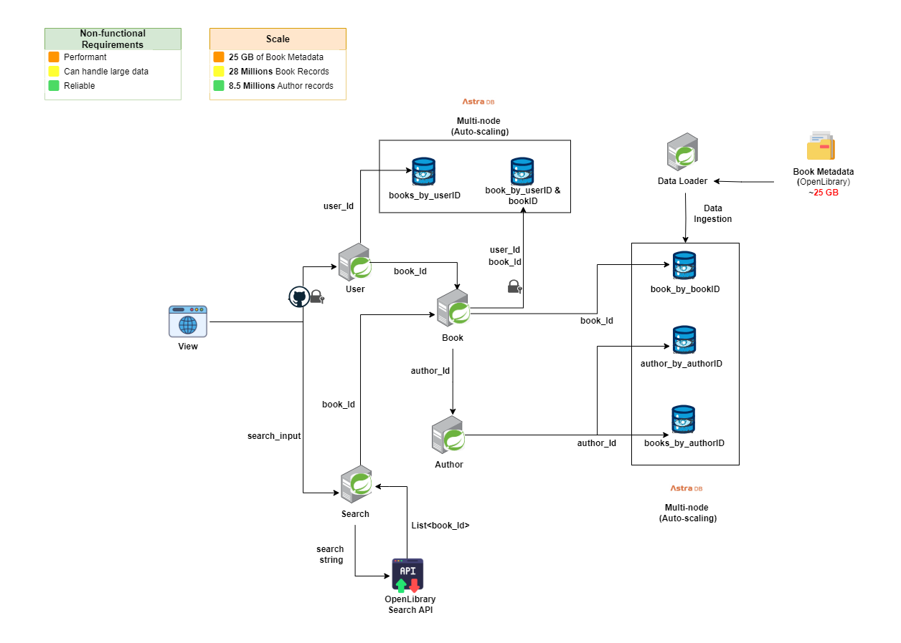
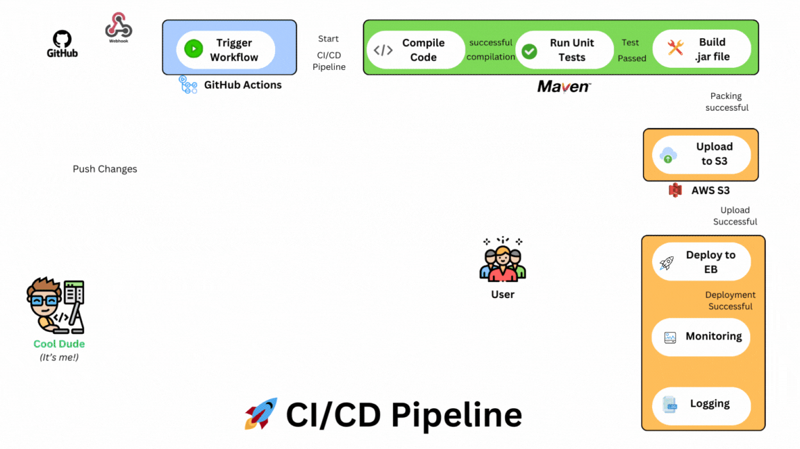

# 📰Better Reads: A Highly Performant Book Tracking Application

**Better Reads** is a full-stack application inspired by GoodReads, built with a focus on scalability and high performance.  The primary objective is to create an application that can handle and serve a vast catalog of every book ever published in the world, allowing users to browse, track their reading progress, and rate books efficiently, even with ***28+ millions*** of book records.

## 💎Key Features

* **Comprehensive Book Catalog**: Store and serve information on every book ever published globally.
* **Book Tracking**: Users can mark books as read, currently reading, and rate them on a 5-star scale.
* **Reading Progress Tracking**: Users can track their reading progress and view their recently-read books.
* **Highly Scalable Architecture**: Designed to handle large amounts of data and scale seamlessly with increasing user load.
* **High Performance**: Optimized for fast page loads and efficient data retrieval, ensuring a smooth user experience.

## 🛠️Tech Stack

* **Backend**: Spring Boot
* **Database**: Apache Cassandra (using DataStax Astra DB, a hosted Cassandra service)
* **Security**: Spring Security with GitHub OAuth login
* **View Rendering**: Thymeleaf
* **Data Access**: Spring Data Cassandra (Repository Pattern)

## Architecture Highlights

* **NoSQL Database (Apache Cassandra)**:Chosen for its ability to handle large amounts of data efficiently and scale horizontally.
* **Hosted Cassandra Service (DataStax Astra DB)**: Provides a managed Cassandra instance, eliminating the need for local installation and scaling based on load.
* **GitHub OAuth Integration**: Secure user authentication and authorization using GitHub OAuth.
  
## 😍User Experience (UX)

The application offers a user-friendly experience for browsing and tracking books. Here's a quick overview of the key functionalities:

<!--   -->

  

**Pages:**

* **Book:** View book details (cover, title, description). Logged-in users can mark books as "Read," "Currently Reading," or "Not Read." Optionally, a rating system can be implemented.
* **Author:** Lists all books written by a particular author in reverse chronological order (newest first). Accessible by clicking the author's name on the Book page.
* **Search:** Enables searching for books by title.
* **Login:** Uses OAuth (Github, Facebook) for user authentication (not required for basic search).
* **Home (Logged Out):** Provides search functionality.
* **Home (Logged In):** "My Books" section displays the user's recently read books (up to 50) in reverse chronological order, with the currently reading book at the top.

**User Flows:**

* Users can browse the app without logging in (search for books).
* Only Logged-in users can track their reading progress by marking books.
* Clicking on an author's name leads to the Author Page showcasing all their books.

This architecture lays the foundation for a high-performing, scalable, and reliable application to manage a vast book collection.

## 📐 Data Modeling and Schema Design

### 1. Understanding the Requirements

  

    
  

**Core Data Entities:**
- **Books:** Represents individual books with details such as title, author, publication date, etc.
- **Authors:** Represents authors and their associated books.
- **Users:** Represents users who interact with the system, tracking their reading status and ratings.

**Key Functional Requirements:**
- Efficient retrieval of book details by book ID.
- Retrieval of all books by a specific author, sorted by publication date.
- User-specific operations, such as tracking reading progress and rating books.
- Display of a user's recently read books, with the ability to prioritize those currently being read.

**Non-Functional Requirements:**
- **Scalability:** Must handle a dataset with 28+ million books and a growing user base.
- **Performance:** Fast retrieval times for queries, especially those involving large datasets.
- **Consistency:** Maintain data consistency, particularly in user-related operations.

### 2. Data Modeling Strategy

      

**Design Considerations:**
- **Query-Driven Schema Design:** Schema design in Cassandra should be driven by the application's query patterns, focusing on read efficiency.
- **Denormalization:** Data denormalization is used to avoid complex joins, enhancing read performance at the cost of additional storage.

### 3. Schema Design and Table Definitions

      

**1. Books by ID**
- **Purpose:** Store detailed information about each book, enabling quick retrieval by book ID.
- **Table Structure:**
    - **Partition Key:** `book_id` (ensures all details of a specific book are stored together).
    - **Columns:** `title`, `author_id`, `publication_date`, `genre`, `summary`, etc.
- **Usage:** Supports fast lookups by book ID, ideal for retrieving book details in response to user queries.

**2. Books by Author ID**
- **Purpose:** Retrieve all books by a specific author, sorted by publication date.
- **Table Structure:**
    - **Partition Key:** `author_id` (groups all books by the same author).
    - **Clustering Key:** `publish_date DESC` (orders books by the most recent publication date).
    - **Columns:** `book_id`, `title`, `genre`, etc.
- **Usage:** Optimized for browsing books by an author and listing them in chronological order.

**3. User Book by Book ID and User ID**
- **Purpose:** Store user-specific data for a particular book, including reading status and ratings.
- **Table Structure:**
    - **Composite Partition Key:** `book_id`, `user_id` (enables efficient retrieval of a user’s data for a specific book).
    - **Columns:** `rating`, `status` (currently reading, finished), `last_updated`.
- **Usage:** Facilitates tracking of reading status and user-specific book information.

**4. User Books by User ID**
- **Purpose:** Retrieve all books a user has interacted with, prioritizing those currently being read and recently finished.
- **Table Structure:**
    - **Partition Key:** `user_id` (groups all books associated with a user).
    - **Clustering Keys:** `status ASC`, `time_uuid DESC` (prioritizes currently reading books and orders by recent interactions).
    - **Columns:** `book_id`, `title`, `author_id`, `rating`.
- **Usage:** Supports user-centric views, like displaying recently read books with currently reading items at the top.

### 4. Partition Strategy and Trade-offs

**Partitioning Strategy:**
- **Balanced Partitioning:** Ensures data is evenly distributed across the cluster to avoid hotspots. Using author IDs and user IDs as partition keys helps distribute load based on these high-cardinality fields.
- **Handling Large Partitions:** For partitions that could grow large (e.g., popular authors or users with extensive reading history), monitoring and potential sub-partitioning strategies (e.g., year-based sub-partitions) may be required.

**Trade-offs:**
- **Denormalization vs. Storage Efficiency:** The schema prioritizes read performance by duplicating data across tables, which trades off storage efficiency.
- **Eventual Consistency:** Due to Cassandra's distributed nature, some operations might exhibit eventual consistency. This is managed by careful schema design and tuning of consistency levels.

## 🏗️ System Design: Scalability and Performance at the Core:

  

### 1. Understand the Problem

**Clarify Requirements:**
- **Core Functionality:** *Better Reads* is a book tracking application that allows users to browse, track their reading progress, and rate books. The system must handle large datasets, including every book ever published, and serve this data efficiently to a potentially large user base.
- **Users:** The primary users are avid readers who want to manage their reading history, discover new books, and connect with other readers. The system should accommodate both casual users (browsing and rating) and power users (extensive reading history tracking).
- **Performance and Scalability Requirements:** The system must support millions of books and handle a growing user base without degradation in performance. It should deliver fast response times, even under high load.
- **Constraints and Limitations:** The application should maintain high availability and fault tolerance. It must support horizontal scaling to manage increasing data volume and user traffic.

**Define Functional and Non-Functional Requirements:**

- **Functional Requirements:**
    - Allow users to search and browse books.
    - Track user reading status (e.g., Currently Reading, Finished).
    - Provide user ratings and display recently read books.

- **Non-Functional Requirements:**
    - **Performance:** Fast search and retrieval of book data, with sub-second response times.
    - **Scalability:** Support for a growing dataset (28+ million book records) and user base.
    - **Availability:** The system should be highly available, with minimal downtime.
    - **Consistency:** Ensure data consistency, particularly in user reading status and ratings.
    - **Security:** Secure user authentication and data protection.

### 2. Deep Dive into Components

**Choose Data Structures and Algorithms:**

- **Cassandra for Book Data:**
    - **Partition Key:** `book_id` for retrieving specific book details.
    - **Clustering Key:** `publish_date` for ordering books by recent publication in queries.
- **Spring Boot for Application Logic:**
    - Manages REST API endpoints, business logic, and integrates with Cassandra using Spring Data Cassandra.
- **GitHub OAuth for Authentication:**
    - Ensures secure login and user data protection.

**Consider Trade-offs:**

- **Data Denormalization:** Improves read performance by avoiding costly joins, at the expense of data duplication.
- **Eventual Consistency:** In exchange for high availability, some operations may exhibit eventual consistency due to the distributed nature of Cassandra.

**Estimate System Capacity:**

- **Data Volume:** Handle 28+ million book records, with an expected growth rate aligned with new book publications.
- **Traffic Estimation:** Assume peak traffic could reach millions of read/write requests per minute during high-activity periods (e.g., after the release of popular book lists).

**Handle Failures:**

- **Fault Tolerance:** Utilize Cassandra’s built-in replication for data durability and fault tolerance.
- **Stateless Services:** Design the application tier to be stateless, allowing easy recovery and load redistribution in case of server failures.

### 3. Identify Bottlenecks and Scale

**Analyze Performance:**

- **Read-Heavy Operations:** Focus on optimizing read operations, such as fetching book details and displaying user reading history, as these are the most frequent.
- **Potential Bottlenecks:**
    - **Database Reads:** If a single partition key (e.g., `author_id`) becomes too large, it may slow down queries. Mitigate this by ensuring balanced partitioning and considering secondary indexes or sub-partitioning strategies.

**Scaling Strategies:**

- **Horizontal Scaling:** Scale out the database and application services by adding more nodes to handle increased load, which is gonna be managed by AWS Elastic Beanstalk.
- **Sharding:** Distribute data across multiple clusters to manage large datasets effectively, , which is gonna be managed by DataStack AstraDB managed cluster effectively.

## 🚀 CI/CD Pipeline

To ensure smooth and automated deployment of the *Better Reads* application, I have implemented a robust CI/CD pipeline using **GitHub Actions**, **Maven**, **AWS S3**, and **AWS Elastic Beanstalk**. This pipeline automates the entire build, test, and deployment process, allowing for continuous integration and continuous delivery of updates to the application.

  

### Key Components:

- **GitHub Actions**: Automated workflows are triggered on each commit to the repository. These workflows handle the build, test, and deployment processes.
- **Maven**: The project is built using Maven, which handles dependencies and ensures that the application is compiled and packaged correctly before deployment.
- **AWS S3**: The packaged application artifacts are stored in an S3 bucket, providing a reliable and scalable storage solution.
- **AWS Elastic Beanstalk**: The application is deployed to AWS Elastic Beanstalk, which manages the environment and handles scaling, load balancing, and monitoring.

### Pipeline Workflow:

1. **Code Commit**: When changes are pushed to the repository, GitHub Actions triggers the CI/CD pipeline.
2. **Build and Test**: Maven compiles the code, runs unit tests, and packages the application. If the build and tests are successful, the pipeline proceeds to the deployment stage.
3. **Build Output Storage**: The build output (aka .jar file) is uploaded to AWS S3, ensuring that it is safely stored and accessible for deployment.
4. **Deployment**: AWS Elastic Beanstalk automatically deploys the latest version of the application from S3 to the production environment. The environment is continuously monitored, and any issues are automatically managed by Elastic Beanstalk.

This CI/CD pipeline streamlines the development process, allowing for faster iterations and ensuring that the *Better Reads* application is always up-to-date and running smoothly.
